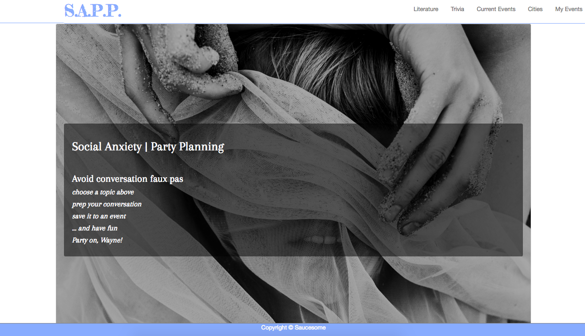
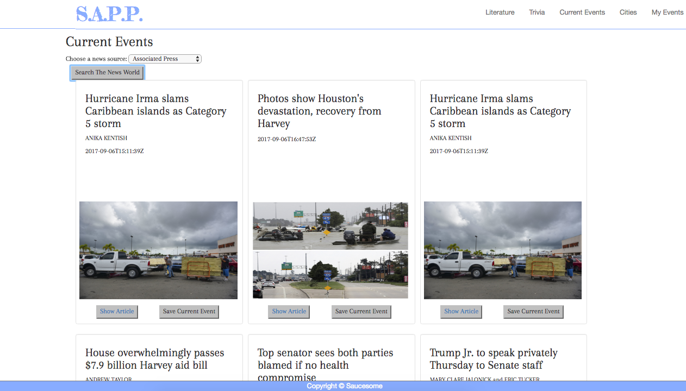
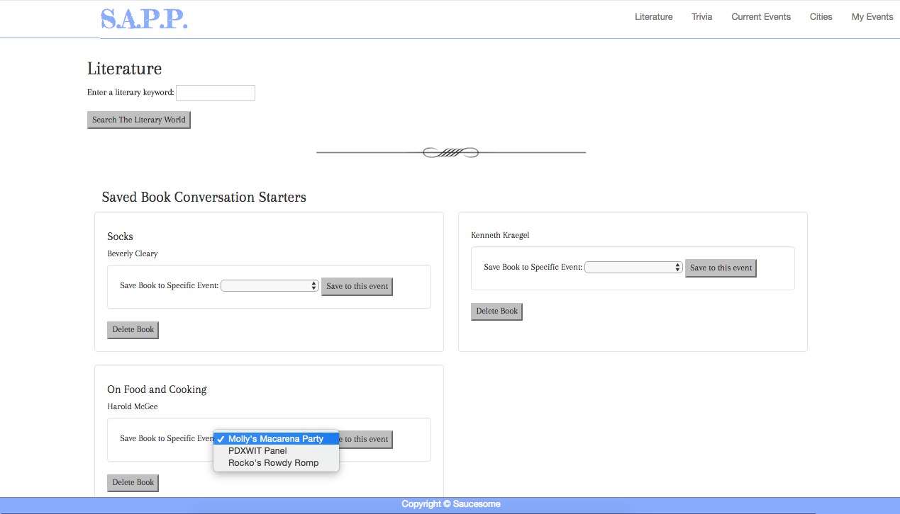

# SAPP

#### _Epicodus Team Project: Social Anxiety Party Planning, September 6th, 2017_
_**By Brittany Kerr, Calla Rudolph, Max Scher, Larry Taylor, and Michelle Poterek **_

## Description
This web application will empower people with social anxiety to better prepare for social events, mitigate their symptoms, and reduce their isolationist impulses. Users can choose to search for conversations revolving around literature, trivia, current events, and various cities for assistance in conversations.

## SAPP Program Preview

_SAPP Home Page_


_Users are able to search for current events from 12 different news sources and preview the top 9 stories from the source selected._


_Users can search for a book based on author, title, or subject matter._


_Saved Literature Page that displays before searching for an author. This content remains at the bottom of the page after searching for a book by title, subject, or author. Users have the ability to save a book to an event using the dropdown menu._


## Installation Instructions
* Open Terminal and type:
* `$ cd Desktop`
* `$ git clone https://github.com/kerrbrittany9/SAPP.git`
* `$ cd SAPP`
* `$ npm install`
* `$ bower install`
* `$ atom .`

### Firebase Configuration
* First off, you'll need to make a free account at Firebase's website. [Firebase](https://www.learnhowtoprogram.com/javascript/angular-extended/firebase-introduction-and-setup)
* Create a New Project. Select this option, provide a name for your new project, and select your Country/region from the drop-down menu.
* Select Add Firebase to your web app.
* In the project, make a file called: **src/app/api-keys.ts**
* paste the code below into your api-keys.ts file.

````
export var masterFirebaseConfig = {
    apiKey: "xxxx",
    authDomain: "xxxx.firebaseapp.com",
    databaseURL: "https://xxxx.firebaseio.com",
    storageBucket: "xxxx.appspot.com",
    messagingSenderId: "xxxx"
  };

````
* With the information provided in the modal, replace the "xxxx" variables with your own firebase credentials in your api-keys.ts file.

### Configure API Keys

* In the project, make a file called: **src/app/api-key-current-events.ts** and paste the following code.
````
export var masterNewsApiConfig = {
  apiKey: "xxxx",
}
````
* Visit [News API](https://newsapi.org/register) and register for an API key. Replace the xxxx's with your key in the `api-key-current-events` file
----

* Make another file called: **src/app/api-key-google.ts**

  ```
  export var masterGoogleBooksConfig = {
    apiKey: "xxxx",
  }
```
* Visit [GoogleBooks](https://console.developers.google.com/projectselector/apis/credentials) to retrieve your API Key and paste it into the file accordingly.
----

### Serving Program
* Be sure to save these changes in your code text editor (Atom).
* In Terminal, run `$ ng serve`
* In your Browser (Chrome preferred) navigate to [http://localhost:4200/](http://localhost:4200/)


## Technologies Used
* Angular CLI
* NodeJS
* Bower
* TypeScript
* Firebase
* Bootstrap, CSS, and HTML

## Acknowledgements
Thanks to the following API's used:
  * [Google Books](https://console.developers.google.com/apis/library?project=project-name-179116&q=google%20book)
  * [Cities](https://developers.teleport.org/api/getting_started/#life_quality_ua)
  * [Current Events](https://newsapi.org/)
  * [Trivia](https://opentdb.com/api_config.php)

## Known Bugs
* There are no known bugs at the time.

## Support and contact details
Please feel empowered to make any changes to this repository by forking it and making changes accordingly.

## Check Team Saucesome's GitHubs!
* [Brittany Kerr](https://github.com/kerrbrittany9)
* [Michelle Poterek](https://github.com/PoterekM)
* [Max Scher](https://github.com/maxobaxo)
* [Calla Rudolph](https://github.com/CallaRudolph)
* [Larry Taylor](https://github.com/larryjtaylor)

## License Information
This web application is free to use under the MIT License &copy; Team Saucesome.

----


# _Additional Developer Information_

## Development server

Run `ng serve` for a dev server. Navigate to `http://localhost:4200/`. The app will automatically reload if you change any of the source files.

## Code scaffolding

Run `ng generate component component-name` to generate a new component. You can also use `ng generate directive/pipe/service/class/module`.

## Build

Run `ng build` to build the project. The build artifacts will be stored in the `dist/` directory. Use the `-prod` flag for a production build.

## Running unit tests

Run `ng test` to execute the unit tests via [Karma](https://karma-runner.github.io).

## Running end-to-end tests

Run `ng e2e` to execute the end-to-end tests via [Protractor](http://www.protractortest.org/).
Before running the tests make sure you are serving the app via `ng serve`.

## Further help

To get more help on the Angular CLI use `ng help` or go check out the [Angular CLI README](https://github.com/angular/angular-cli/blob/master/README.md).
